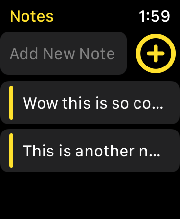
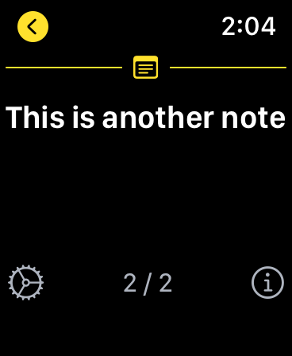
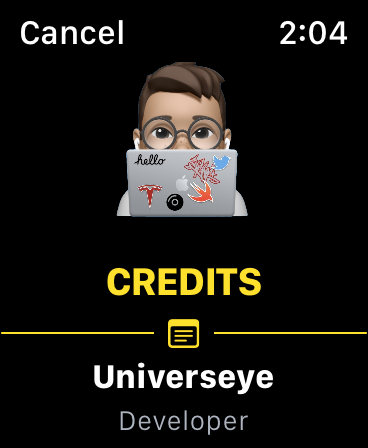

# Apple Watch-Notes App
SwiftUI, a notes taking app only for apple watch follow the courses by [Credo Academy](https://www.youtube.com/c/CredoAcademy).

# Menu
* [Screenshots](#screenshots)
* [Source](#source)
* [Contributions](#contributions)
* [Contact](#contact)

# Screenshots

 

# Source
This notes taking app follow the courses by [Credo Academy](https://www.youtube.com/c/CredoAcademy), fully developed with SwiftUI.

# Contributions

* All kinds of contributions (enhancements, new features, documentation & code improvements, issues & bugs reporting & todo task) are welcome. Let's make it better.

# Contact
Created by [Terry Kuo](https://twitter.com/ArgonYoYo) - feel free to contact me!
